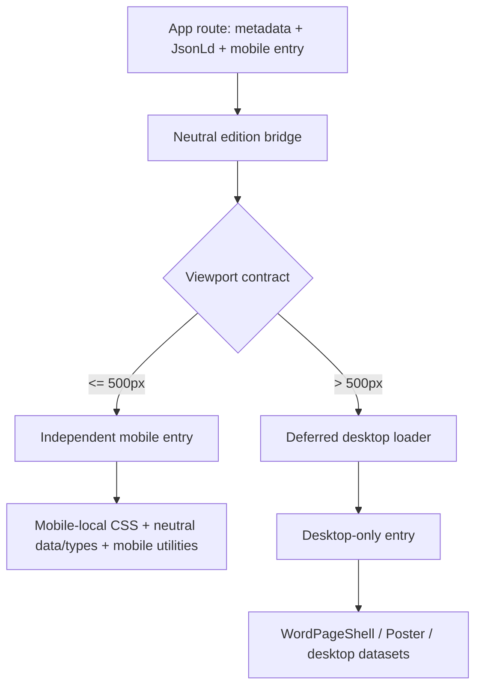

# Words Over Time 移动端设计文件完整解耦报告

日期：2026-08-22

审计对象：9 条 canonical 公开内容路由、4 个特殊公开 surface、全部移动端组件与 CSS、版本装配、相关验证脚本，以及当前 worktree。

移动端合同：`width <= 500px`

核心设计宽度：`390px`

桌面端入口：`width >= 501px`

```text
AUDIT_STATUS=PASS
MOBILE_DESKTOP_PRESENTATION_DEPENDENCIES=0
LEGACY_960_MOBILE_BOUNDARIES=0
READY_FOR_USER_VISUAL_ACCEPTANCE=false
```

`READY_FOR_USER_VISUAL_ACCEPTANCE` 保持为 `false`，因为本报告能确认架构、依赖、构建与浏览器行为，但不能替用户宣布视觉验收。

## 1. 结论

移动端现已从桌面端展示层解耦：

- 9 条 canonical 公开内容路由不再直接导入桌面组件、Poster、`WordPageShell` 或桌面数据装配。
- 10 个移动端入口的递归依赖图没有命中任何桌面展示文件。
- 53 个 release-tree 移动设计/兼容文件的直接导入扫描没有命中任何桌面展示文件。
- Home、About、Forever、Artificial、Hub、Privacy、Data、Depression、Words index 与错误页均以移动端独立入口存在。
- `500px` 是移动端最后一个整数宽度；`501px` 起在 hydration 完成后只挂载桌面入口。服务端快照保持 mobile，所有活动移动 root 在 501px 有防御隐藏。
- production 环境的 390px Home 与 Data 资源清单没有加载桌面、Poster 或 `WordPageShell` 命名的设计 chunk。
- Forever 移动端不再依赖 `WordPageShell`；导航、标题和研究开场已成为 `MobileForeverStudy` 自己的组成部分。
- 六个 word study 均由各自移动依赖图提供 `<main>` landmark，不再依靠桌面 `WordPageShell` 补齐页面语义。

桌面端视觉没有在本任务中重新设计。为执行唯一的 500/501 版本合同，Home/About desktop root 不再自行做第二次 breakpoint 选择；桌面 Poster、数据和 `WordPageShell` 被收入独立桌面入口。

## 2. 最终装配结构



关键约束：

- 移动入口可以使用 React、Next、移动端内部组件、中性 registry、数据、类型与 provenance。
- 移动入口不能使用 `/desktop/`、`Desktop*`、`*Poster`、`WordPageShell`、共享 `Nav`、`SearchIntentSummary`、`EvidenceCoverageStrip` 或 `WordSeoSummary`。
- 桌面模块的 `import()` 只在桌面分支实际挂载后开始；移动入口不会在自身依赖图中拉入桌面展示模块。Home/Data 的 production 资源抽查与这一装配结果一致。
- 服务端快照保持移动内容，因此移动端 SSR 与无 JavaScript 阅读保持完整；桌面选择在 hydration 后加载独立桌面入口。

## 3. 逐路由整改

| 路由 | 整改前的耦合 | 当前结构 |
| --- | --- | --- |
| `/` | 同一路由直接渲染 `MobileHome` 与 `DesktopHome`；60rem 切换 | `MobileHome` + `HomeEditionBridge`；桌面 Home 延迟加载 |
| `/about` | Mobile/About desktop 同时存在；隐藏的桌面 client islands 仍可 hydration | `MobileAbout` + `AboutEditionBridge`；桌面 About 独立加载 |
| `/words` | 一套 responsive JSX 与共享 `Nav`，501–639 无明确归属 | 独立 `MobileWordsIndex`、独立 CSS、独立桌面 index 与 bridge |
| `/words/forever` | 移动版被 `WordPageShell` 包裹；960px `ResponsiveForeverEdition` | `MobileForeverStudy` 自有开场；桌面 `DesktopForeverEdition` 才使用 shell/Poster |
| `/words/artificial` | 位于 `/mobile/` 的 boundary 接收完整 desktop ReactNode，并修改全局背景 | 中立 bridge；移动 study 不接触桌面；桌面 shell/Poster 独立入口 |
| `/words/hub` | 两套 ReactNode 一起进入 boundary；初始总是 mobile | 中立 bridge；移动 Hub 独立；桌面 Hub 延迟加载 |
| `/words/privacy` | 移动与七组桌面数据、Poster 共用 `WordPageShell` | 页面只装配移动分析；桌面数据与 Poster 全部迁入 desktop entry |
| `/words/data` | 移动树、四组桌面 JSON 与 Poster 同页渲染；多个 959px runtime guard | 页面只装配 `MobileDataStudy`；桌面数据/Poster 独立；runtime guard 为 500px |
| `/words/depression` | UA 分支或 CSS 双树；隐藏移动树可修改桌面 `html/body/theme-color` | 无 UA/QA override；中立 bridge；移动与桌面数据/副作用隔离 |
| 404/500 | 一个组件同时包含移动与桌面视觉及共享 CSS | 独立移动/桌面组件、各自 CSS、延迟桌面加载 |

## 4. Forever 专项确认

Forever 是本次最重要的共享 shell 清理点：

- `src/app/words/forever/page.tsx` 只导入移动 study、移动分析、中立 bridge 与 JsonLd。
- `MobileForeverStudy.tsx` 不导入 `WordPageShell`、`Nav`、任何 Poster 或 desktop 文件。
- 移动版导航、`WORD STUDY`、`forever` 标题和两阶段研究导语均由移动端本地 JSX/CSS 所有。
- 在 Forever 路由依赖图中，`WordPageShell` 只在 `forever/desktop/DesktopForeverEdition.tsx` 内出现；其他 word study 也只允许各自的 desktop entry 使用 shell。
- 390px production DOM：`mobileEditionCount=1`、`sharedWordShellCount=0`。
- 删除旧 `ResponsiveForeverEdition.tsx`、顶层 `ForeverDesktopEdition.tsx` 与废弃 `ForeverMobileEditorial.tsx`。
- Forever 根节点自身是 `<main>`，不再从共享 shell 借用 landmark。

## 5. 移动端文件清单

release tree 自动清单共 53 个设计/兼容文件：

| 分组 | 数量 | 当前入口或用途 |
| --- | ---: | --- |
| Home | 3 | `MobileHome.tsx`、scroll highlights、local CSS |
| About | 3 | `MobileAbout.tsx`、citation copy、local CSS |
| Forever | 9 | Study、4 个图形模块、EvidenceRail、DataGate、2 个 local CSS |
| Artificial | 6 | `MobileArtificialStudy.tsx`、motion/interaction 模块与 local CSS |
| Hub | 10 | `MobileHubStudy.tsx`、atmosphere、plots/rails/explorers、local CSS |
| Privacy | 2 | 已发布 `MobilePrivacyStudy` + local CSS |
| Data | 4 | `MobileDataStudy.tsx`、dot scene/layout、local CSS |
| Depression | 9 | mobile entry/study/deck/card/figures/wheel/navigation/viewport helper/CSS |
| Words index | 2 | 独立移动 index + CSS |
| Error | 2 | 独立移动错误页 + CSS |
| Shared mobile utilities | 2 | `MobileScrollRevealScope` 与 `useMobileScrollReveal` |
| Legacy-named compatibility helper | 1 | `MobileFrequencyStory.tsx`；当前只被桌面历史图形消费，因研究 manifest 仍记录其路径而保留 |

特殊但已扫描的非公开文件：

- `ForeverMobileDataGate.tsx`：未由公开路由渲染，但研究 manifest 仍记录；其 CSS 已补齐本地 paper/ink/accent tokens，不依赖桌面展示 token。
- `installDepressionViewportHeight.ts`：当前无消费者，保持无桌面依赖。
- 未发布的 Artificial refinement CSS 与 Privacy prototype 不进入 release tree；它们与历史 evidence 一起保存于具名本地 stash，公共 demo 只保留 canonical redirect。

## 6. 活跃入口递归依赖审计

由 `scripts/audit_mobile_desktop_decoupling.ts` 递归解析本地 import：

| 移动入口 | 可达文件数 | 禁止依赖 |
| --- | ---: | ---: |
| Mobile Home | 5 | 0 |
| Mobile About | 3 | 0 |
| Mobile Forever | 10 | 0 |
| Mobile Artificial | 13 | 0 |
| Mobile Hub | 11 | 0 |
| Mobile Privacy | 4 | 0 |
| Mobile Data | 7 | 0 |
| Mobile Depression | 11 | 0 |
| Mobile Words index | 3 | 0 |
| Mobile Error | 3 | 0 |

同一脚本还检查：

- 全部 53 个 release-tree 移动设计文件的直接依赖；禁止依赖为 0。
- 六个 word study 的可达移动文件是否各自提供 `<main>` landmark；缺失为 0。
- 9 条 canonical 内容路由是否直接装配 desktop/Poster/`WordPageShell`；命中为 0。
- Privacy demo 是否仍重定向，以及 error/global-error/not-found 是否仍使用独立 ErrorStatePage 装配；4 个特殊 surface 全部通过。
- `959px`、`960px`、`59.999rem`、`60rem`、`min-[960px]`、`md:hidden`；命中为 0。
- `EditionBoundary` 是否保留 `max-width:500px` 与 `min-width:501px` 合同。

## 7. 颜色、字体与全局 CSS 解耦

为防止未来桌面 token 调整改变移动视觉：

- Home、About、Forever 在自己的 root 内重新声明其实际移动纸色、墨色和 route colours。
- Privacy 使用自己的 paper/ink/palette literal，并声明移动字体栈。
- Hub 将当前实际计算纸色固定在移动 root，不再依赖全局 paper fallback。
- Artificial、Data、Depression 原本已使用 route-local tokens，继续保持。
- Words index 与 Error 页使用各自局部 token。
- `globals.css` 中的移动 body fallback 只在 `max-width:500px` 生效；全站 `MobileProjectBackdrop` 实验已移除。
- `layout.tsx` 已恢复为中性 root layout，不再全路由注入移动背景组件。

全局 reset、`box-sizing`、基础字体 fallback 和链接 reset 被视为展示无关的基础设施；移动端的关键颜色、版式和 route atmosphere 不再依赖桌面组件或桌面 CSS。

## 8. 构建与研究验证脚本解耦

### Home

- `audit_mobile_home_source.ts` 现在只读取 MobileHome、移动 CSS 与中性 words registry。
- DesktopHome/PosterMarks 检查已迁入独立 `audit_desktop_home_source.ts`。
- 桌面 Home 的未来文案或色带改动不会让移动 Home audit 失败。

### Artificial research tooling boundary

- 本地审计确认未发布的 Artificial builder 曾读取 `ArtificialPoster.tsx`，并已完成去除桌面展示依赖的实验性修订。
- 该 builder 的 inventory hash 仍需要 97 个未跟踪条目，其中 37 个是 ignored raw active dependencies；因此 builder、ledger 与 regenerated output 不进入本次 main release，也不接入 clean-clone CI。
- 相关研究工作保存于具名本地 stash；main 中的移动 runtime 与 audit 不导入或执行这套不完整 pipeline。

### 自动防回归

新增 `scripts/audit_mobile_desktop_decoupling.ts`，用于阻止：

- mobile → desktop/Poster/shell/import；
- 旧 960px 移动边界回流；
- canonical public route 重新同时装配两套展示；
- Privacy demo redirect 或三类错误 surface 偏离既定装配；
- 500/501 合同漂移。

该审计已接入 `npm run verify`，不是只供人工抽查的孤立脚本。

## 9. 浏览器验证证据

当前树手工验证环境：Next.js 16.2.5，localhost development，2026-08-22 最终构建后。production build 另行针对当前树完成。

| 宽度 | 路由数 | 版本结果 | 横向溢出 | Console |
| ---: | ---: | --- | --- | --- |
| 390px | 9 | 全部 mobile | 0/9 | 0 error / 0 warning |
| 500px | 9 | 全部 mobile | 0/9 | 0 error / 0 warning |
| 501px | 9 | hydration 后全部 desktop | 不属于移动审计 | 0 error / 0 warning |

逐路由覆盖：`/`、`/about`、`/words`、Forever、Artificial、Hub、Privacy、Data、Depression。

附加验证：

- 390px Home、About、Forever 首屏进行了视觉检查。
- About 默认状态：Research method 打开；Design、Source、License、Contact 关闭。
- Forever 390px 首屏保留导航、word-study 标识、标题、导语和第一张研究图。
- 六个 390px word study 的 DOM 均为一个 mobile root，`WordPageShell` 数量为 0。
- 六个 390px word study 均只有一个 `<main>` landmark。
- Home scroll 会改变 word highlight 与 palette segment progress。
- `/words/privacy/mobile-demo` 返回重定向到 `/words/privacy`，不再作为公开实验设计。
- Home 与 Data 的 production 390px 代表性资源抽查均无 desktop/Poster/`WordPageShell` 命名资源；该浏览器资源清单未另存为独立 artifact，因此本报告将它标为手工证据。

构建验证：

- `npx tsc --noEmit --pretty false --incremental false`：PASS
- `npm run build`：PASS；31 个静态页面生成
- `git diff --check`：tracked diff PASS；本任务新增的 untracked 源码另以 `--no-index --check`、TypeScript、build 和解耦 audit 覆盖。
- Mobile Home audit：PASS
- Desktop Home audit：PASS
- Artificial mobile research `--check`：本地 retained-input 环境 PASS；不作为 clean-clone release gate
- Mobile/Desktop decoupling audit：PASS

## 10. Worktree 清理

已执行的低风险清理：

- 删除 6 条指向不存在 `/private/tmp` 的 stale worktree metadata；分支与唯一提交未删除。
- 本地 `main` 从落后 47 个提交快进到 `origin/main`；未切换当前工作分支。
- 还原构建生成的 `tsconfig.tsbuildinfo`。
- 删除未提交且全局耦合的 `MobileProjectBackdrop` 实验，并恢复中性 `layout.tsx`。
- 撤回 `WordPageShell` 内为 Artificial 添加的移动/桌面混合条件。
- 删除旧 edition orchestrators：`ResponsiveForeverEdition`、`ResponsiveArtificialEdition`、`HubEditionBoundary`。
- 删除废弃 `ForeverMobileEditorial` 与 `MobileChapterNav`。
- 把旧 Privacy mobile demo 从公共实验页改为 canonical redirect，同时保留原型源文件。
- 停止验证用的 localhost:3100 production server；最终构建后恢复 localhost:3000、重置临时 viewport，并保留 Home 验收页。

没有执行 blanket clean，而是对 release 与历史工作分别处理：

- 本次 main release 只包含可在 clean clone 构建的移动解耦 runtime、audit 与报告。
- Artificial/Data 的采集、分析、builder、research provenance，Hub/Data/Artificial 多轮 evidence，以及 Data/Depression predesign 历史保存于具名本地 stash；没有删除或伪装成完整 CI 输入。
- `.cache/google-ngram` 与 ignored raw research inputs；它们是研究输入/采集缓存，不是普通 build cache。
- Privacy 旧 prototype、Artificial refinement CSS 与两个任务前已有的 Privacy hydration rounding 修复同样保存于具名 stash；Privacy LFS 删除已恢复。
- `package.json` 只新增可在干净 clone 运行的解耦审计并接入 `verify`。

没有运行 `git clean -fd`、`git clean -fdX`、`git reset --hard` 或 `git restore .`。因此“清理完成”表示边界实验、生成产物和 stale metadata 已整理，而不是用破坏性命令让 `git status` 表面为空。

## 11. 后续边界

- 用户已批准将本报告覆盖的整理内容推送到 `main`；最终 commit SHA 与远端状态记录在发布交接中。
- 501–959px 现在明确属于桌面 edition，但本任务没有审计或重新设计该宽度的桌面视觉。
- 若以后修改 desktop Home/About/Poster/`WordPageShell`，必须继续通过解耦 audit，保证移动依赖图保持为 0。
- 未发布 prototype、历史 evidence 与 provenance 若要归档或删除，应另行做有 manifest 的资产整理，不应与运行时架构提交混合。
